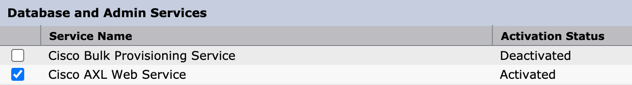
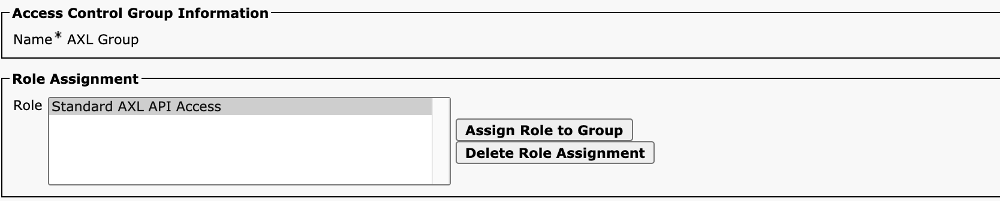

# Python SDK for Cisco CUCM AXL API
[](https://github.com/PresidioCode/ciscoaxl/actions/workflows/python-publish.yml)

## AXL API Documentation

- https://developer.cisco.com/docs/axl-schema-reference/

## Installation

```bash
pip install ciscoaxl
```

`testing in a lab is highly recommended. if you don't have a lab of your own, you can reserve a DevNet Sandbox free of charge!`

## Reserve a DevNet Sandbox (if required)

The	DevNet	Sandbox	is	accessible	 through	Cisco	DevNet	at	http://developer.cisco.com

Select	Collaboration	on	the	right	hand category menu	and	then look	for	the	“Collaboration	12.5”	tile.	
Hit	reserve.

To connect to the lab, you'll need to use VPN.

VPN Credentials will be sent to your DevNet registered email account, or you can view the _OUTPUT_ from the topology page. 

Once connected, you can click on the server, in this case CUCM, and select _ATTRIBUTES_ to find username, password, and hostname / ip address.


___


## Enable AXL SOAP Service on CUCM:

Enable the AXL SOAP interface

Browse to the CUCM Serviceability page on https://<IP_CUCM>/ccmservice

Tools > Service Activation:

Enable the "Cisco AXL Web Service"



---

## Create an AXL Service Account

> Step 1 - Create an AXL User Group

CUCM > User Management > User Group > Add.

> Step 2 - Assign the AXL role to the group

On the top right drop down list "Related Links". 


Select "Assign Role to User Group" and select "Standard AXL API Access"




> Step 3 - Create a new Application User

CUCM > User Management > Application User > Add.


Add the User Group "AXL Group" to this user so that after saving the roles of the new Application User appear as in the following screen:


## SDK Usage 

```python
from ciscoaxl import axl

cucm = '10.10.20.1'
username = 'axlaccess'
password = 'axlpassword'
version = '12.5'
ucm = axl(username=username,password=password,cucm=cucm,cucm_version=version)
```

> Note: all get methods that return more than 1 item have a tagfilter property that can allow more fields to return. Fields are filtered by default to increase performance, but if you need additional fields returned from the axl call, simply add the tagfilter={} to the request. Example:

```python
get_phones(tagfilter={ "name": "",
            "product": "",
            "description": "",
            "protocol": "",
            "locationName": "",
            "callingSearchSpaceName": "",
            "devicePoolName": ""
        })
```

## Users

#### Get All Users

```python
for user in ucm.get_users():
    print(user.firstName)
```

#### Get Specific User

```python
user = ucm.get_user(user_id='mscott')
print(user.email)
```

#### Add User

```python
ucm.add_user(user_id='jlevensailor', last_name='Levensailor', first_name='Jeff')
```

#### Delete User

```python
ucm.delete_user(user_id='jlevensailor')
```

#### Update User

```python
ucm.update_user(user_id='jlevensailor', password='Lagavulin16', pin='5432')
```

## Phones

#### Get Phones

```python
for phone in ucm.get_phones():
    print(phone.name)
```

#### Get Specific Phone

```python
phone = ucm.get_phone(name='SEP001122445566')
print(phone.name)
```

#### Add Phone

```python
ucm.add_phone(
    name='SEP0023AF482340',
    description='Robert - 1102',
    product='Cisco 8861',
    device_pool='RTP_DP',
    location='RTP_LOC',
    phone_template='Standard 8861 SIP',
    protocol='SIP',
    css='AVST-CSS',
    subscribe_css='AVST-CSS',
    lines=[
        ('1102', 'ABQ_PT', 'Robert Smith', 'Robert Smith', 'Robert Smith - 1102', '+1408202XXXX')
    ]
)
```

#### Delete Phone

```python
ucm.delete_phone(name='SEP004433220043')
```

## Translations and Transformations

#### Get Translation Patterns

```python
for trans in ucm.get_translations():
    detailed = ucm.get_translation(uuid=trans.uuid)
    print(detailed.description)
```

#### Get Specific Translation Pattern

```python
trans = ucm.get_translation(pattern='2XXX', routePartitionName='xlates-pt')
print(trans.description)
```

#### Add Translation Pattern

```python
ported = ['12324625544', '12324625545', '12324625546']

for num in ported:
    ucm.add_translation(pattern=num, routePartitionName='pstn_pt',calledPartyTransformationMask='1102', callingSearchSpaceName='GW_CSS')
```

#### Delete Translation Pattern

```python
ucm.delete_translation(pattern='34567', routePartitionName='xlates-pt')
```

#### Update Translation Pattern

```python
ucm.update_translation(pattern='1234', routePartitionName='xlates-pt', newPattern='4567')
```

## Device Pools

#### Get Device Pools

```python
for dp in ucm.get_device_pools():
    print(dp.name)
```

#### Get Specific Device Pool

```python
dp = ucm.get_device_pool(name='RTP_DP')
print(dp.name)
```

#### Add Device Pool

```python
ucm.add_device_pool(device_pool='Hollywood_DP')
```

#### Delete Device Pool

```python
ucm.delete_device_pool(device_pool='Hollywood_DP')
```

#### Update Device Pool

```python
ucm.update_device_pool(name='RTP_DP', regionName='G711_RGN')
```

## CSS and Partitions

#### Get Calling Search Spaces

```python
for css in ucm.get_calling_search_spaces():
    print(css.name)
```

#### Get Specific Calling Search Space

```python
css = ucm.get_calling_search_space(calling_search_space='pstn-css')
print(css.name)
```

#### Add Calling Search Space

```python
ucm.add_calling_search_space(
    calling_search_space='VIP_CSS',
    description='Very Important Stuff'
    members=['losfeliz-pt','silverlake-pt','pstn-pt']
    )
```

#### Delete Calling Search Space

```python
ucm.update_calling_search_space(calling_search_space='VIP_CSS')
```

#### Delete Calling Search Space

```python
ucm.delete_calling_search_space(calling_search_space='VIP_CSS')
```

#### Get Partitions

```python
for pt in ucm.get_partitions():
    print(pt.name)
```

#### Get Specific Partition

```python
pt = ucm.get_partition(routePartitionName='pstn-pt')
print(pt.name)
```

#### Add Partition

```python
ucm.add_partition(routePartitionName='VIP_PT', description='Very Important Peep')
```

#### Delete Partition

```python
ucm.delete_partition(name='VIP_PT')
```

## Regions and Locations

#### Get Regions

```python
for reg in ucm.get_regions():
    print(reg.uuid)
```

#### Get Specific Region

```python
reg = ucm.get_region(region='losfeliz_reg')
print(reg.name)
```

#### Add Region

```python
ucm.add_region(region='Hollywood-REG')
```

#### Delete Region

```python
ucm.delete_region(region='Hollywood-REG')
```

#### Get Locations

```python
for loc in ucm.get_locations():
    print(loc.name)
```

#### Get Specific Location

```python
loc = ucm.get_location(name='Shadow')
print(loc.name)
```

#### Add Location

```python
ucm.add_location(location='Hollywood-LOC')
```

#### Delete Location

```python
ucm.delete_location(location='Hollywood-LOC')
```

## Directory Numbers

#### Get Directory Numbers

```python
for dn in ucm.get_directory_numbers():
    print(dn.uuid)
```

#### Get Specific Directory Number

```python
dn = ucm.get_directory_number(pattern='2888',routePartitionName='losfeliz-pt')
print(dn.uuid)
```

#### Add Directory Number

```python
ucm.add_directory_number(
    pattern='1102',
    routePartitionName='ABQ_PT'
    )
```

#### Delete Directory Number

```python
ucm.delete_directory_number(uuid='{0B0CDC93-EC9C-7255-1B09-40A3CE727D5A}')
```

## Device Profiles

#### Get User Device Profiles

```python
for udp in ucm.get_device_profiles():
    print(udp.name)
```

#### Get Specific User Device Profile

```python
udp = ucm.get_device_profile(name='udp-bsimpson')
print(udp.name)
```

#### Add User Device Profile

```python
ucm.add_device_profile(
    name='UDP_MScott',
    description='Michael Scott - 2901',
    product='Cisco 8861',
    phone_template='Standard 8861 SIP',
    protocol='SIP',
    lines=[
        ('2901', 'losfeliz-pt', 'Michael Scott', 'Michael Scott', 'Michael Scott - 2901', '+1408202XXXX'),
        ('2902', 'losfeliz-pt', 'Pam Beesley', 'Pam Beesley', 'Pam Beesley - 2902', '+1408202XXXX')
    ]
)
```

#### Delete User Device Profile

```python
ucm.delete_device_profile('UDP_Mscott')
```

## CTI Route Points

#### Get CTI Route Points

```python
for cti in ucm.get_cti_route_points():
    print(cti.name)
```

#### Get Specific CTI Route Point

```python
cti = ucm.get_cti_route_point(cti_route_point='AutoAttendant')
print(cti.name)
```

#### Add CTI Route Point

```python
ucm.add_cti_route_point(
    cti_route_point='aa-pilot',
    description='pilot to unity',
    device_pool='LosFeliz_DP',
    css='allphone-css',
    lines=[
        ('2908', 'losfeliz-pt'),
        ('2909', 'losfeliz-pt')
    ]
)
```

#### Delete CTI Route Point

```python
ucm.delete_cti_route_point(name='OneArch')
```

## Route Groups, Lists, and Patterns

#### List Route Plan

```python
nums = ['19197016707', '19197016712', '19197016713', '19197016706', '191970167016']

for num in nums:
    for route in ucm.list_route_plan(num):
        print(route.dnOrPattern)
for route in ucm.list_route_plan('2901'):
    print(route.uuid)
```

#### Get Route Groups

```python
for rg in ucm.get_route_groups():
    print(rg.name)
```

#### Get Specific Route Group

```python
rg = ucm.get_route_group(route_group='losfeliz-rg')
print(rg.uuid)
```

#### Add Route Group

```python
ucm.add_route_group(
    route_group='hollywood-rg',
    distribution_algorithm='Circular',
    members=[('america-online-sip'), ('h323')])
```

#### Delete Route Group

```python
ucm.delete_route_group(route_group='hollywood-rg')
```

#### Get Route Lists

```python
for rl in ucm.get_route_lists():
    print(rl.name)
```

#### Get Specific Route List

```python
rl = ucm.get_route_list(route_list='stdloc-rl')
print(rl.description)
```

#### Add Route List

```python
ucm.add_route_list(
    route_list='hollywood-rl',
    description='hollywood',
    run_on_all_nodes='true',
    cm_group_name='Default',
    members=[
        ('losfeliz-rg'),
        ('silverlake-rg')
    ])
```

#### Delete Route List

```python
ucm.delete_route_list(route_list='hollywood-rl')
```

#### Get Route Patterns

```python
for rp in ucm.get_route_patterns():
    print(rp.pattern)
```

#### Get Specific Route Pattern

```python
rp = ucm.get_route_pattern(pattern='911')
print(rp.description)
```

#### Add Route Pattern

```python
ucm.add_route_pattern(
    pattern='999',
    routePartitionName='losfeliz-pt',
    description='Movie Times',
    route_list='stdloc-rl'
    )
```

#### Delete Route Pattern

```python
ucm.delete_route_pattern(pattern='999', routePartitionName='losfeliz-pt')
```

## Runs and Dos

#### Execute SQL Query

```sh
for sql in ucm.run_sql_query('select * from device where description like "Bart%"'):
    print(sql.name)
```

#### Do LDAP Sync on all agreements

```sh
for ldap in ucm.get_ldap_dir():
    ucm.do_ldap_sync(uuid=ldap.uuid)
```

#### Reset Device

```python
ucm.do_device_reset(device='SEP001100220033')
```

#### Extension Mobility Login

```python
ucm.do_device_login(device='SEP001100220033', userId='bsimpson')
```

#### Extension Mobility Logout

```python
ucm.do_device_logout(device='SEP001100220033', userId='bsimpson')
```
