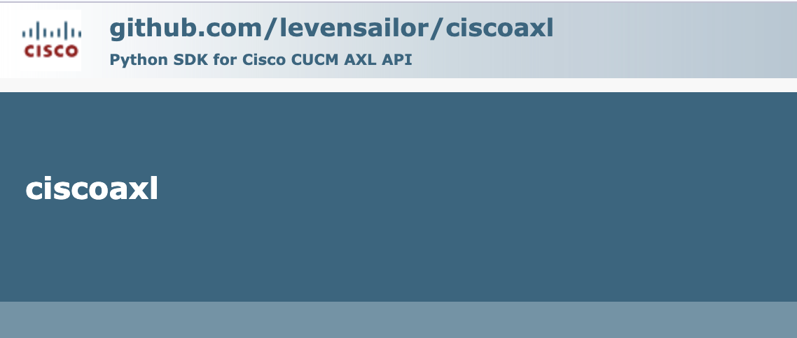

Documentation [ciscoaxl.readthedocs.io/en/latest](https://ciscoaxl.readthedocs.io/en/latest).
Repository [github.com/levensailor/ciscoaxl](https://github.com/levensailor/ciscoaxl).
PyPi [pypi.org/project/ciscoaxl/](https://pypi.org/project/ciscoaxl/).

## AXL API Documentation

- https://developer.cisco.com/docs/axl-schema-reference/

## Installation

```bash
pip install ciscoaxl
```

## Enable AXL SOAP Service on CUCM:

Enable the AXL SOAP interface

Browse to the CUCM Serviceability page on https://<IP_CUCM>/ccmservice

Tools > Service Activation:

Enable the "Cisco AXL Web Service"


---

## Create an AXL Service Account

> Step 1 - Create an AXL User Group

CUCM > User Management > User Group > Add.

> Step 2 - Assign the AXL role to the group

On the top right drop down list "Related Links". 


Select "Assign Role to User Group" and select "Standard AXL API Access"


> Step 3 - Create a new Application User

CUCM > User Management > Application User > Add.


Add the User Group "AXL Group" to this user so that after saving the roles of the new Application User appear as in the following screen:


## SDK Usage 

```python
from ciscoaxl import axl

cucm = '10.10.20.1'
username = 'axlaccess'
password = 'axlpassword'
version = '12.5'
ucm = axl(username=username,password=password,cucm=cucm,cucm_version=version)
```
